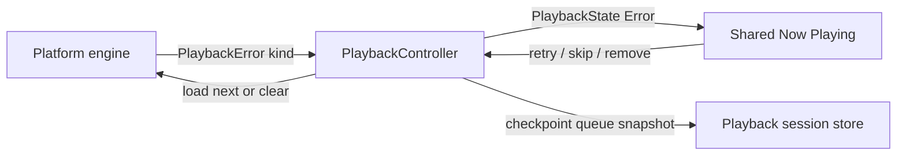

# Playback failure recovery design

## Goal

Turn a terminal local-playback error from static text into a safe, shared recovery flow. A listener can retry the selected occurrence, move to the next occurrence, or remove only the failed occurrence from the playback queue. The feature never deletes a media file, edits library persistence, removes a library source, or changes platform permission state.

## Existing boundary

`:core:playback` owns `PlaybackState`, `PlaybackError`, the queue, active generation, persistence checkpoints, and all platform engines behind `PlatformPlaybackEngine`. It currently stores only a free-form `PlaybackError.message`; an error resets playback to `PlaybackStatus.Error`, while Now Playing shows that message but continues to expose generic transport controls.

`PlaybackController` already has a serialized queue-mutation boundary and uses occurrence IDs to preserve duplicate tracks. `removeUpcoming` intentionally rejects the current occurrence, so it cannot represent an error-resolution removal. The shared Now Playing feature is a leaf that consumes controller state and invokes controller commands; it must not inspect platform exceptions or touch the library.

## Decision

### Structured, fail-closed categories

Add `PlaybackFailureKind` to the public core contract:

- `MissingFile` — the platform has direct evidence that the local media file no longer exists;
- `AccessLost` — the platform reports an unreadable/revoked local handle;
- `UnsupportedFormat` — the platform reports unsupported media/container/codec data;
- `DecoderFailure` — the platform reports a decoder failure after accepting the source;
- `Unknown` — any other failure, including platforms that cannot supply a reliable native reason.

`PlaybackError` carries the kind along with its localized, listener-safe message and optional diagnostic cause. It defaults to `Unknown` so existing engine/test call sites remain source-compatible until migrated.

Platforms classify only factual native evidence. Android uses Media3's documented source/permission/parser/decoder error codes and preflight evidence for ordinary file paths. iOS and macOS preflight managed local paths for absence; iOS's current provider Boolean failures and native macOS `load == false` remain `Unknown` unless the platform supplies a stable reason. Generic controller exceptions remain `Unknown`. A dedicated core `PlaybackFailureException` carries the exact `PlaybackError` through a failed load so the controller's asynchronous catch cannot overwrite an earlier structured engine callback with generic text.

### Queue-only recovery commands

Add three `PlaybackController` commands that are accepted only when commands are enabled and state is `Error` with a current occurrence:

1. `retryFailedTrack()` reloads that same occurrence with `autoPlay = true`; successful load clears the error.
2. `skipFailedTrack()` chooses the next effective occurrence without repeat wrapping and loads it with `autoPlay = true`. At the effective-order end it is a no-op and leaves the failure visible.
3. `removeFailedTrack()` serializes with queue mutations, removes exactly the failed current occurrence, and never alters library state. It chooses the next effective occurrence from the pre-removal effective order and autoplays it. When none exists, it clears the engine, retains all other queue occurrences, publishes `Idle` with no current occurrence, and checkpoints the queue transition.

The remove operation is `suspend`, because it must share `sessionOperationMutex` with reorder/remove-upcoming/clear-upcoming. The UI launches it from a remembered coroutine scope and ignores a rejected/no-op result; it does not bypass command gates.

### Error-only recovery surface

Now Playing renders a compact recovery section only when there is a current occurrence and `PlaybackStatus.Error` with `PlaybackError`:

- the failure category is summarized in listener wording, with the existing platform message retained as secondary detail;
- **Retry** invokes retry;
- **Skip** invokes skip;
- **Remove from queue** invokes current-occurrence removal.

The recovery section owns clear test tags/content descriptions and uses feature-owned English and Chinese resources. Generic transport, scrubber, shuffle, and repeat controls remain available exactly as existing error-state behavior permits. No recovery node, click handler, pointer gesture, or accessibility action exists outside error state.

## Non-goals

- No physical file deletion, SQLDelight changes, source removal, source rebind, Android permission prompt, or Settings routing.
- No automatic skipping, retry backoff, retry count, bulk removal, or queue-history redesign.
- No claim that a category can be inferred when a native engine only reports a Boolean failure.
- No change to route-loss/interruption semantics: those continue to pause rather than enter an error recovery flow.

## Data flow

## Tests and verification

1. Core unit tests RED/GREEN: structured thrown failure survives controller catch; retry reloads the same occurrence; skip selects the effective successor without wrapping; remove advances once; removal of final failed occurrence becomes idle while retaining other queue entries; disabled/stale/non-error requests are no-ops.
2. Platform tests RED/GREEN: Android Media3 classification; iOS/macOS managed-file absence classification; unknown remains unknown for opaque provider/native load failure.
3. Now Playing JVM semantics RED/GREEN: exact recovery card/action nodes appear only in error; each button invokes only its command; card removal after successful replacement; localized resource ownership/parity.
4. Run focused core/Now Playing/platform tests, then formatting, Detekt, architecture, `./init.sh`, and practical desktop/Android/iOS recovery smoke paths where a known playable source can be made unavailable.

## Risks

- **Stale callbacks selecting the wrong occurrence:** retain existing generation guards and capture the effective successor before mutation.
- **Queue checkpoint racing the selection:** mutate under `sessionOperationMutex`, publish the queue snapshot before loading, and use existing immediate checkpoint mechanics.
- **Misleading failure reason:** use `Unknown` unless a platform-specific API makes a factual classification.
- **Destructive interpretation:** label removal as queue-only and cover it with tests that the library is never consulted.
